# 🎮 Juego del Ahorcado en C++

  
  
  

## Descripción 
Este proyecto surguió a través del deseo de replicar uno de los juegos embleáticos de los niños ecuatorianos llamado **Ahorcado**. Con el lenguaje de programación C++ se pudo implementar la lógica que hiciera posible que este juego se vea plasamado en una pantalla. 
El programa incluye:
1. Modo de un jugador.
2. Modo de dos jugadores.
3. Sistema de usuarios.
4. Sistema de puntajes.
5. Top scores.
6. Validación de entradas.
7. Dibujo progresivo del ahorcado con CTurtle.
8. Lectura de palabras desde archivo externo.

## Funcionalidad

- 🎯 Selección de modo de juego:  Se da la opción de elegir al usuario el nivel de dificultad al que se quiere enfrenatar. Dependiendo de su elección se abrirá el txt palabras_facil, palabras_medio o palabras_dificil.  
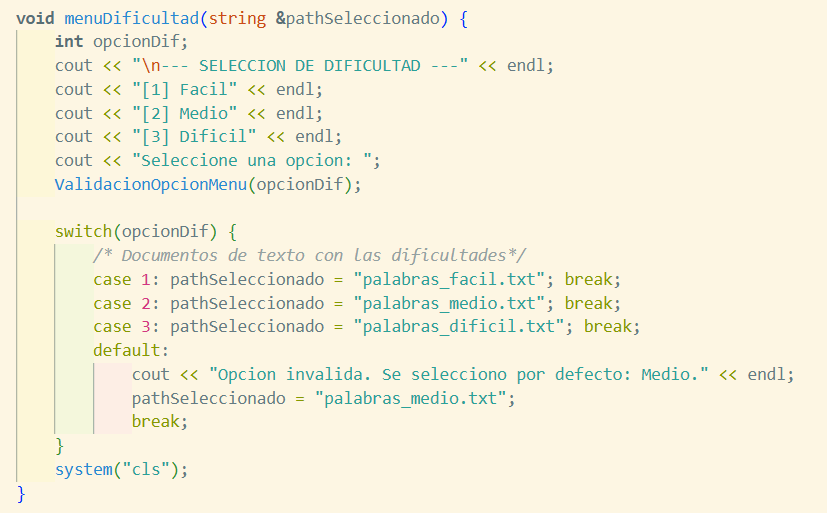
- 👤 Registro e inicio de sesión de usuarios: Se implememtó el registro e inicio de sesión con la finalidad de mantener un historial de los puntajes de nuestros usuarios e ir publicando a nuestros mejores jugadores.
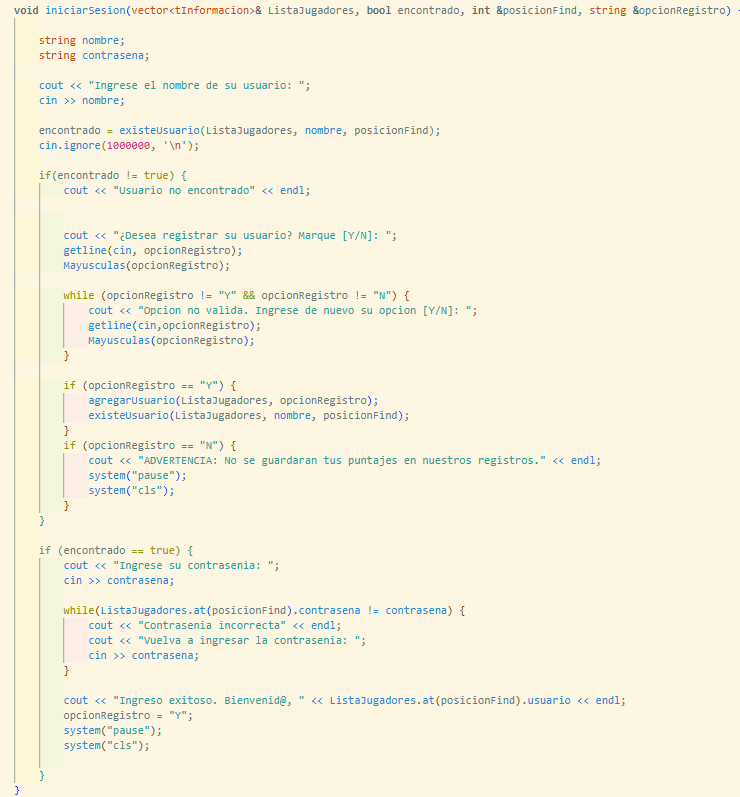
- 🔐Validación de usuario y contraseña: Se busca dentro de nuestro cvs "listaJugadores" la existencia de ese usuario y contraseña. Si no existe se da la opción de Registro.
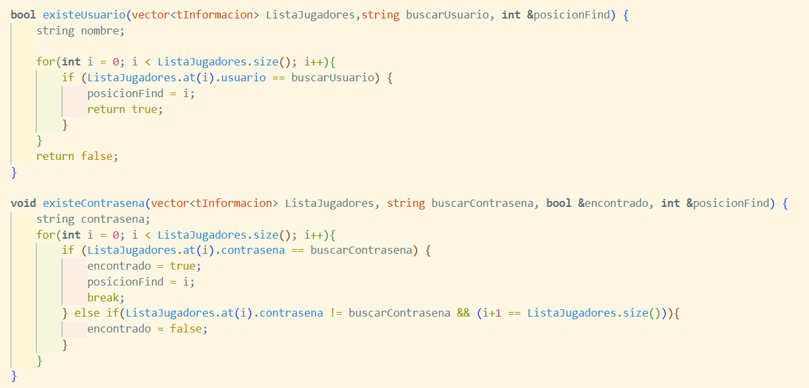
- 🎲 Selección aleatoria de palabras: El txt elegido será escaneado por un random para elegir de manera aleatoria una sola palabra.
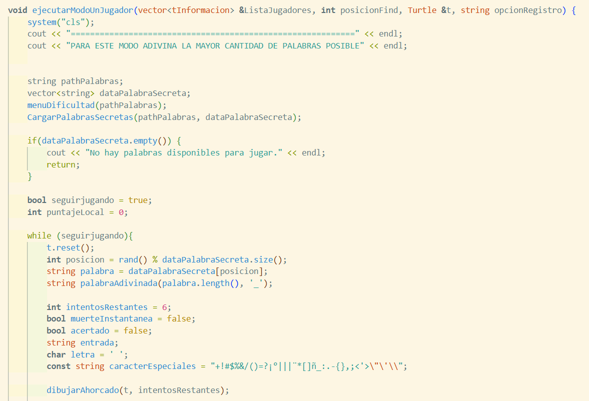
- 🔠 Conversión automática a mayúsculas: Todas las desiciones que tome el usuario y sean escritas en la terminal serán pasadas por un subprograma para convertirlas a mayúsculas.  
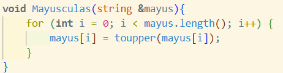
- 🚫 Validación de números y símbolos: Si se detecta cualquier caracter especial escrita por el usuario se negará su validez y se volverá a pedir que ingrese de nuevo su opción sin este error.  
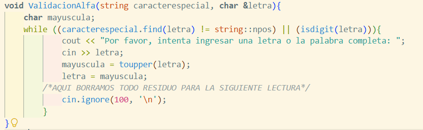
- 💀 Muerte instantánea si se falla la palabra completa.
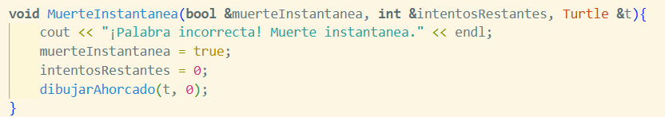
- 🐢 Dibujo progresivo con CTurtle.
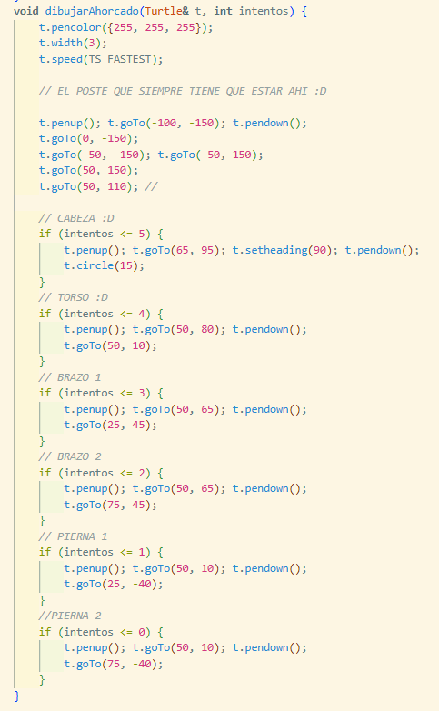
- 🏆 Sistema de puntajes.
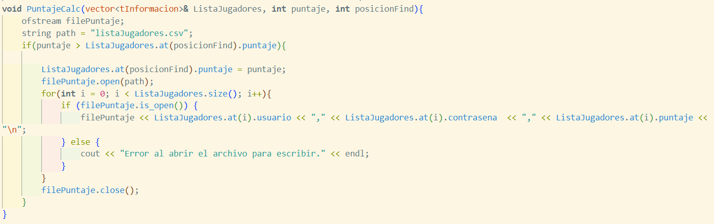  
- 📊 Tabla de mejores puntuaciones.
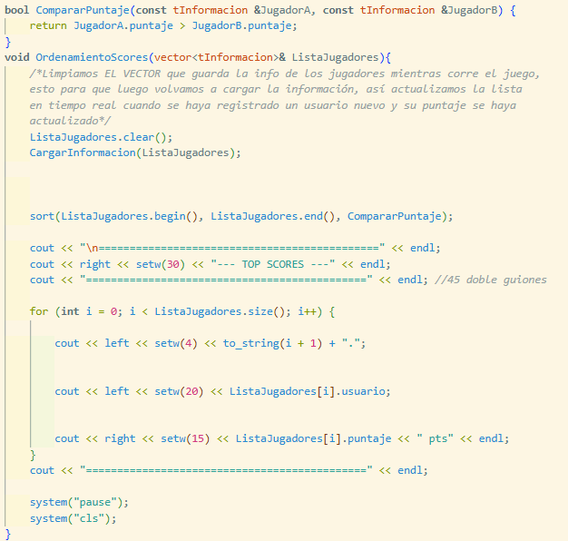

## Diagrama de uso

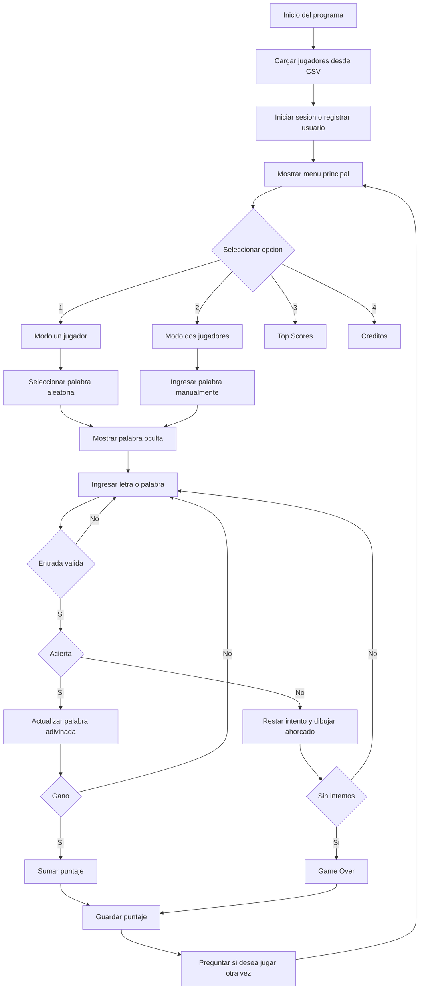

## Estructura del código

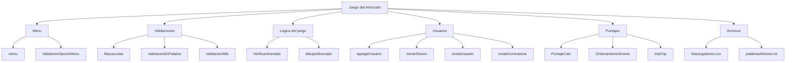
